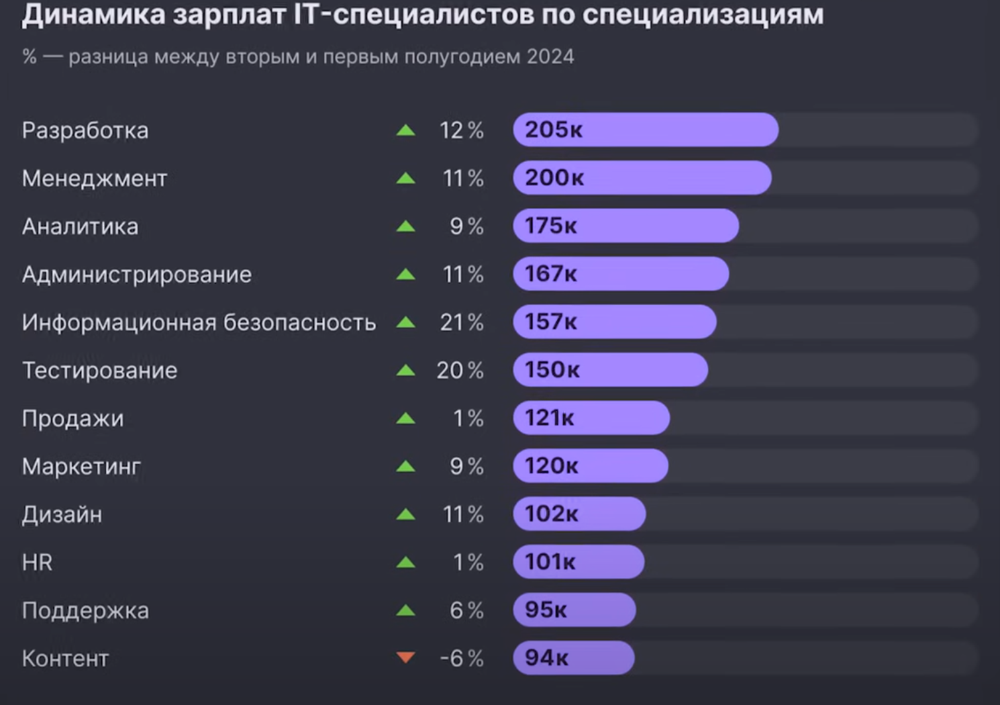
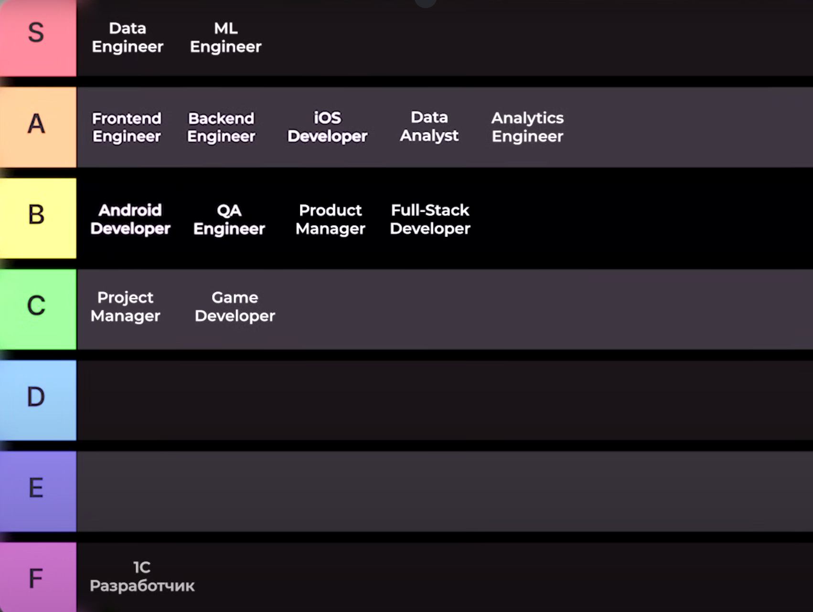
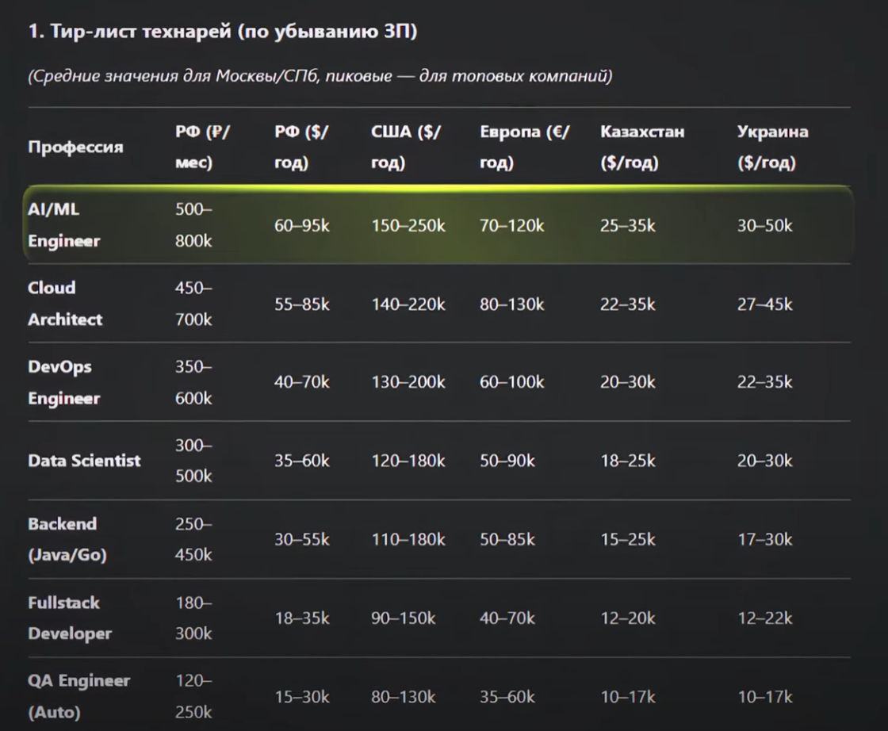
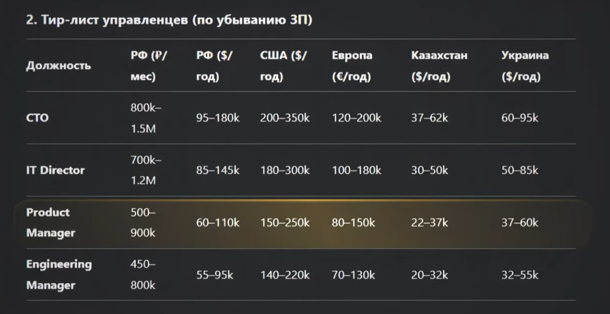

> **Четверг:** с 9:00 до 21:00 с минимальными перерывами
> **Итог:** 10–11 часов

# Посмотрел общую инфу про стажировки и айти

### Видео

* [ML в современном мире (11 минут, живо и просто)](https://youtu.be/1SLvIof4-Zw?t=4850)
* [вайб кодинг](https://youtu.be/1SLvIof4-Zw?t=6644)

---

### Янг Кон

* [Спитч на 13 минут про ИИ от Яндекса](https://youtu.be/lzS1wHg2Qyo?t=10336)

**Выжимка:**

* нужно погружаться в ИИ, следить за новинками, пробовать
* попасть на любую стажировку с 15 раза — нормально

---

### Code Run - сайт тренировки решения задач от Яндекса

Тренировки по алгоритмам и ML.

**Как готовиться к стажировке в Яндексе:**

* решай задачи на LeetCode / CodeRun (low/medium/hard)
* по 2 задачи в день::
* цель: за 1 час научиться решать 2 medium задачи
* нужно решить хотя бы **15 типовых задач × по 50 штук из одного типа** 
  
После этого можно на собес в Яндекс

---

### Гарри Мурадян

[Трудоустройство, реализация карьеры. Как найти работу? Как составлять резюме?](https://www.youtube.com/watch?v=gLF8sNVx_5s)
(не могу прям рекомендовать к просмотру, но мб будет интересно)

**Основное:**

* стажировка = отличный тест выбранной сферы
* если понял, что сфера не твоя — меняй
  
* в резюме:
  * бизнес-фото
  * желаемая позиция
  * опыт работы (что делал, цифры, статистика)
* готовь ответ про зарплату (ориентируйся на hh):
Для ответа - посмотри на hh похожие должности в разных компаниях и выбери сумму

**Где искать работу:**

1. Знакомства/связи
2. Сайты компаний
3. Кадровые агентства
4. Ярмарки вакансий
5. Оффлайн поиск
6. ТГ-каналы, hh и др.

---

### Испытательный срок

Его тоже нужно пройти. Не всегда легче, чем собес.

---

### Джуны нужны

[Как найти РАБОТУ в IT джуну и стажеру?](https://www.youtube.com/watch?v=nnPqywZuf9M)

**Советы:**

* ищи не только на hh, но и на сайтах компаний
* не пиши "ozon стажировка python", а просто "ozon стажировки". Потому что иногда вакансии не оптимизированы и там просто ничего нет в тегах про python или разработку
* собирай все вакансии, даже в "трешовых" компаниях
* сохраняй ссылки на соцсети компаний
* на hh не ставь фильтры по городу и удалёнке
* ищи с "без опыта" и "1–3 года опыта" одновременно
* пиши сопроводительное письмо

---

### Тирлисты и гайды

* [ТИРЛИСТ IT профессий (2025)](https://www.youtube.com/watch?v=DUZ8RfU0HT4)

* [IT-карьера в 2025: перспективные профессии (8 минут)](https://www.youtube.com/watch?v=iVPsQDJoZOE)

* [Самые прибыльные профессии в IT (2025)](https://www.youtube.com/watch?v=b26dTS2_1kg)

Хорошо описаны профессии + везде написано что нужно знать:
* [10 Самых Оплачиваемых IT профессий для 2025 года](https://www.youtube.com/watch?v=DDYxuM0YB6U)

---

### Прикольные идеи:

* нетворкинг: конференции, соцсети
* Объединяешься: бэкендер и фронтентер -> идёте делать заказы на фриланс для мелких бизнесов
* Как же все рофлят над бумом 1C. Кто не в курсе, сейчас мегахайпует 1C, там огромные ЗП. Но все говорят, что 1С это бесперспективно: так как используется только в РФ, спрос упадёт, и сам по себе он не кайф

---
---

> **Пятница:** с 9:00 до 19:00 с минимальными перерывами
> **Итог:** 9 часов

Посмотрел инфу про стажировки и айти, начал изучать профессии.

* разработчик = устойчивая профессия, всегда можно уйти во фриланс. Мелким бизнесам нужны сайты, простенькие сервера даже в эру AI
* Отправлять резюме HR'ам утром. Чтобы когда они с утра заходили поработать ты был в топе выдачи (выше в списке)
* На интервью важно показать, что ты горишь продуктом, который будешь создавать

---

### Видео про ИИ

[ИИ заменит программистов за год?](https://www.youtube.com/watch?v=eiq-6a20XKM)
ТОП-видео, почему ИИ не заменит разработчиков.

---

### Итог

Выписал список из всех IT профессий, получилось 50
Цель — сократить 50 профессий до 10-15.

Успел хорошо ознакомиться только с 11 профессиями. 
*Думаю, что за следующие 10-15 часов досмотрю остальные.*

Далее выберу 3-5 профессий и буду делать по ним мини-проекты. Чтобы определиться с конкретной профессией

Сейчас есть мысль: начать с бэкенда, изучить фронтенд, стать фуллстеком.
Потом потихоньку переключаться на ML. 
Что-то типо:
Backend -> FullStack -> Data Engineer -> ML -> DataScience 
Так и стабильная, более простая работа в скором времени будет и не буду исключать то, что чуть позже уйду в сторону математики и современных технологий

   

* Я только после того, как отсмотрел все профессии из папки "Администрирование и инфраструктура" понял, почему в Бонче только одно направление подготовки готовит прогеров. 
Потому что наш ВУЗ готовит именно "Администрирование и инфраструктура". Там не так много пишут кода, там больше провода кладут, сисадминов делают. 

---

# Приложение:
Не моё, просто красивые картинки

  
  
  
  