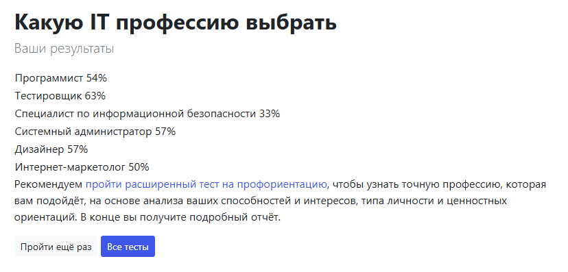
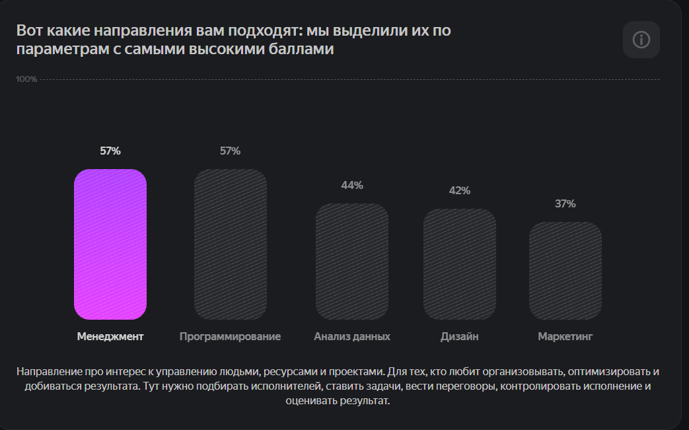
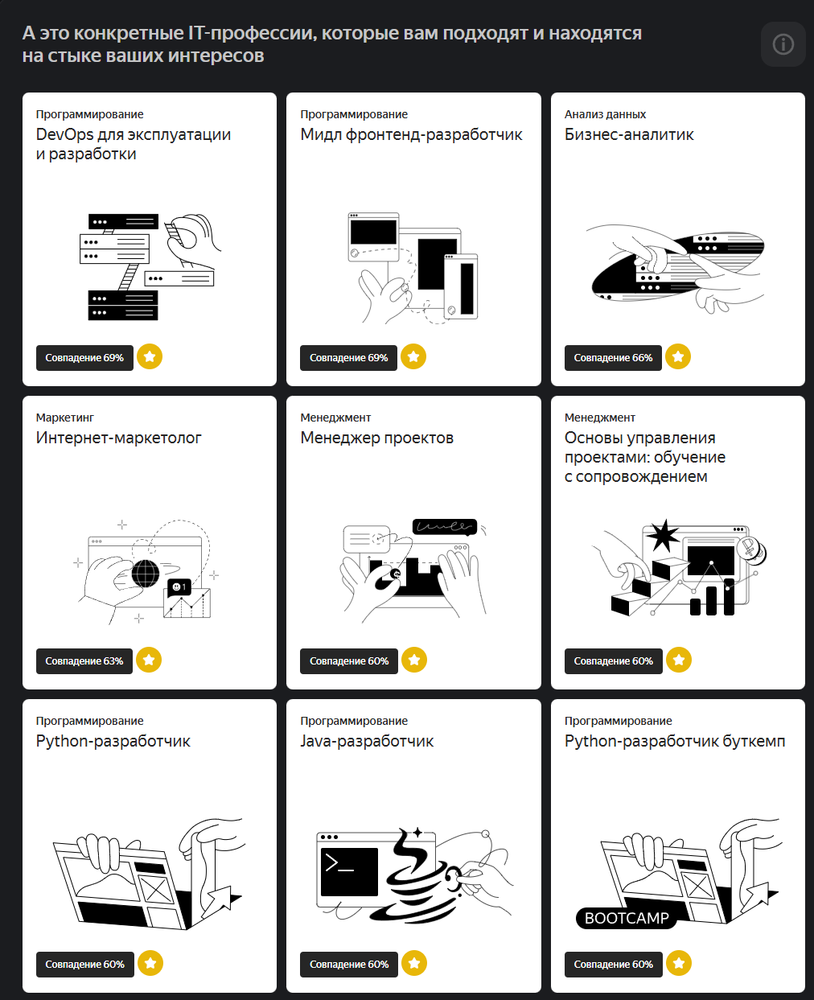
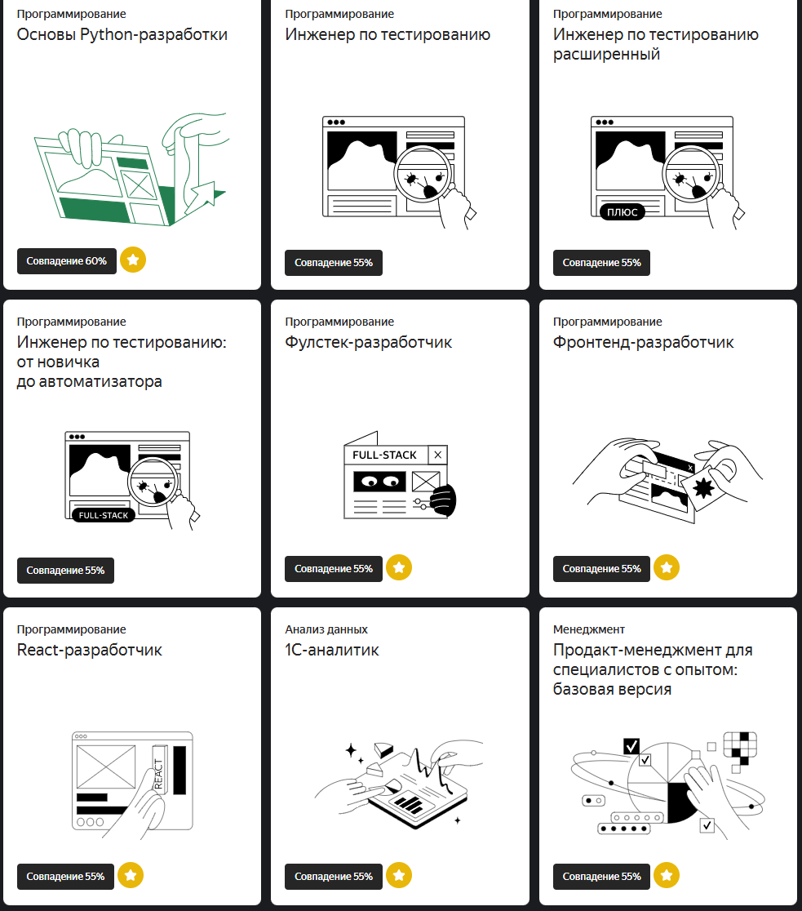

### **Четверг:**
**Время ресёрча:** с 8:30 до 19:00 с минимальными перерывами  
**Итог:** 10 часов

- В ИБ нужно постоянно читать какие атаки недавно были, анализировать какие новые уязвимости появляются. Сидеть на баг баунти хантер сайтах, чтобы что-то оттуда внедрять в инфраструктуру, в которой ты работаешь
- Нужно шарить за интернет сети
- В ИБ не так много кода
- В компаниях часто не понимают, что ИБ делится на несколько областей: делится на тех ,кто защищает код, приложения, мобильные приложения, сети и т.п. И задачи из других областей ИБ могут свалиться на ИБ-шника из другой сферы ИБ

[about Application Security Engineer](https://www.youtube.com/watch?v=-oGxe4CW_Z8)

---

[Про виртуальные мониторы](https://www.youtube.com/watch?v=C1R_J7QPX2E)  
Прикольно, можно AR мониторы сделать. 
Прикинь короче купить такую штуку и ты вроде на ноутбуке где-то на Бали работаешь, а вроде у тебя 3 больших удобных монитора

---

### **Советы по профессиональному росту:**
- Посмотри количество вакансий для разных фреймворков.
- В резюме укажите свои контакты (например, Telegram). Чтобы HR могли писать тебе не через платный hh, а в ЛС

[Полезное для резюме от HR](https://www.youtube.com/watch?v=j989oeo6spo)  

---

**Как бы вы писали бэк для Twitter?** - могут задать такой вопрос на собеседовании))

- Кажется, мне больше нравятся стартапы или маленькие компании, чем крупные.

---

### **Пятница:**
**Время ресёрча:** с 10:00 до 14:00  
**Итог:** 4 часа

- Донеси до работадателя, что ты не собираешься через 6 месяцев свапнуть компанию
- https://roadmap.sh/ - лучше бери профессии отсюда. Тогда они не будут специфичными или профессиями, которые являются ответвлением от профессии.

**Примечание:**  
Как будто сейчас - основная задача выбрать область, из которой будет несложно перейти в смежные профессии. То есть очевидно, что сейчас ты не со 100% вероятностью выберешь то, что тебе будет нравиться всю жизнь. Поэтому логичней сейчас пойти на общую работу, а потом, если захочется, перейдешь в другую область разработки
++ при таком подходе ты сначала создаешь подушку безопасности "так как я 2 года поработал в бэке, я 100% смогу устроиться бэкенд разработчиком. Если в мобильной разработке, куда я сейчас перешёл, у меня что-то не пойдет, то я всё равно могу рассчитывать на 100к в месяц, не помру с голода" 

[Не показывать это видео Сане](https://www.youtube.com/watch?v=CTKRAMddKkE)
(понятное дело, что чел в видео преувеличивает)

---

Научились писать консольный калькулятор, это будет означать что пора делать pet проекты и изучать все остальные навыки на проекте
Выбирай профессию не по ЗП, а по тому, что нравится

**Полезные ссылки:**
- https://youtu.be/OxgYIkv54yk?t=466 - гениально
- Learn English. B2+

- [Полный гайд по gamedev профессиям](https://www.youtube.com/watch?v=q_N6ijrV5uw)

- [Сомнительно, но ОКЭЙ про Product Manager](https://www.youtube.com/watch?v=lr30rIIqkNU)

---

### **Пятница:**
**Время ресёрча:** с 18:30 до 21:30  
**Итог:** 3 часа

- Досмотрел видео о профессиях. Спланировал проекты на следующие 38 часов.
- Составил свой тир-лист профессий. (смотри "все it направления/То что выбрал")

---

### **Суббота:**
**Время ресёрча:** с 13:00 до 17:00  
**Итог:** 4 часа

- Посмотрел видео по топ-7 профессиям, которые выбрал.
- Поверхностно изучил курс по мобильной разработке. Чтобы понимать что это вообще такое

Поверхностно изучил курс по ардуино (закрыл проект) из "То что выбрал.md"
Так лол, мы уже можем на ардуинке любые физические приборы писать. Там используется Си++ и несколько простых библиотечных функций
Но мне не очень вкатила разработка микроконтроллеров. Изи, но вижу только как хобби. Работать в этой области не хочу
Кстати, Arduino можно писать на Python

Взял страницу AllWays по фронтенду, которую я буду верстать на следующей неделе, чтобы вспомнить frontend разработку и определиться, хочу ли я быть фронтендером или нет.

[Мотивашка по обучению программированию](https://www.youtube.com/watch?v=a36YuCZfoxo)

---

### **Профориентационные тесты:**
- [Тест на сайте Profguide](https://www.profguide.io/test/who-are-you-it-professions.html)

  

- [Тест от Яндекс Практикум](https://practicum.yandex.ru/prof-test/result/5e72183b-baf4-4fc3-81a4-2bc6ff941ac6/)

<table>
  <tr>
    <td></td>
    <td></td>
  </tr>
</table>

