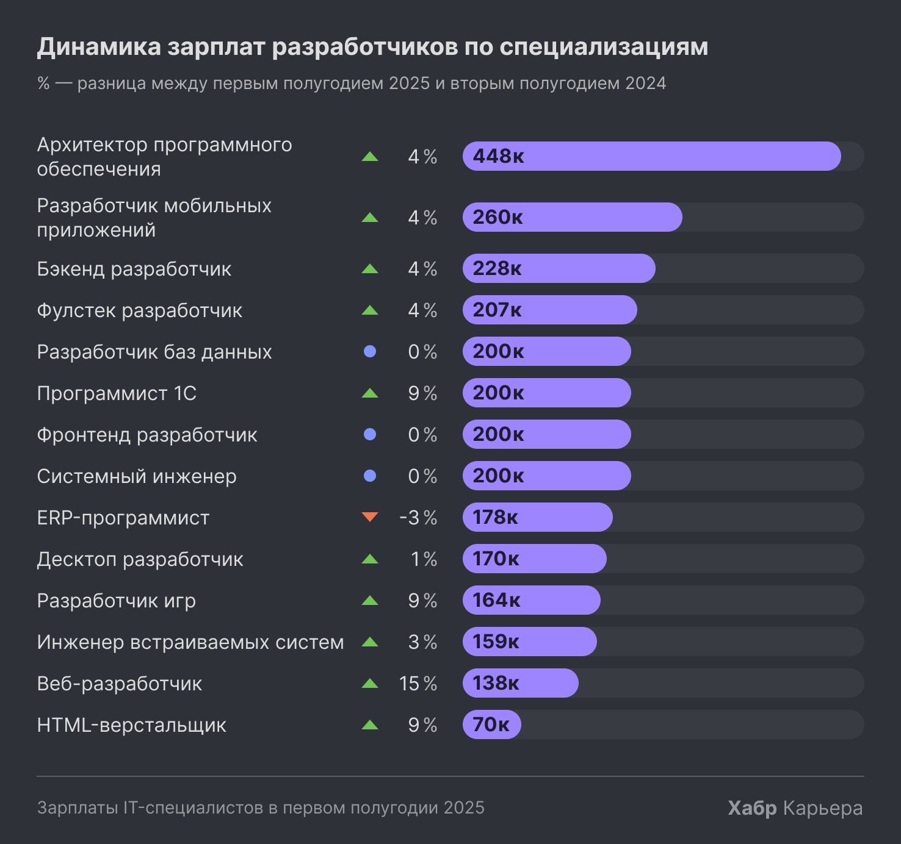

> **Четверг: 14:00 - 17:00**  
> 3 часа  

1 час почитал ваши отчёты, посмотрел видосики.  

**Из отчёта Никиты:**  
> Аутсорс компании для прогеров - может быть прикольной темой.  
> 
> Ты собираешь кучу вакансий по тому направлению, которое выбрал, и собираешь оттуда всё, что нужно уметь, потом отбрасываешь те навыки, которые редко встречаются, а те, которые хотя бы 20 раз встречаются, оставляешь. Таким образом у тебя получится актуальный список того, что нужно знать.  

Яндекс проанализировал за 2024 все вакансии на hh и сделал сводку:  
[Сводка Яндекса](https://practicum.yandex.ru/trainer/start-in-programming/lesson/3819b4ba-f482-4dc9-b86c-811ed687fa59/)  

Бесплатные курсы от Яндекс Практикума (поверхностные, но чтобы профессию опробовать — норм):  
[Бесплатные курсы](https://practicum.yandex.ru/promo/freetracks-ads/?from=start-in-it_freetracks)  

ЗП в IT:  
[Сводка зарплат](https://career.habr.com/salaries?qualification=All&spec_aliases%5B%5D=ml-engineer)  

> **Суббота: 8:30 - 16:30**  
> 8 часов  

Продолжил анализировать профессии, которые меня привлекают. Основная дилема: Python или Go. После изучения ЗП, статей и видосиков — выбираю Python.  

**Python vs Go:**  
- На Go в основном пишут стартапы — нестабильная работа.  
- На Go микросервисы, а не большие структуры.  
- Конкуренция на Go чуть меньше.  
- С Python чаще переходят на Go, чем наоборот. Компании готовы переучивать питонистов, потому что на Go обычно переписывают Python'овские куски кода, архитектура всё равно делается на Python.  

ЗП программистов:  
[Сводка зарплат на Habr](https://habr.com/ru/specials/936618/)  

|  |  |  |  |
|---------------------------|--------------------------|---------------------------|---------------------------|  

Сам проанализировал hh.ru поверхностно:  
- Найдено 500 вакансий «Frontend разработчик»  
- Найдено 150 вакансий «Python разработчик»  
- Найдено 57 вакансий «Android-разработчик»  
- Найдено 52 вакансии «Go разработчик»  
- Найдено 42 вакансии «ML разработчик»  
- Найдено 27 вакансий «iOS-разработчик»  
- Найдено 14 вакансий «Flutter-разработчик»  

**Про профессии, между которыми я выбираю. (из какого-то видосика):**  

**Фронтенд**  
- Сложность освоения: 3.5/5  
- ЗП: 4/5  
- Конкуренция: 4/5  
- Перспективы: 4/5  

**Бэк**  
- Сложность освоения: 4/5  
- ЗП: 4/5  
- Конкуренция: 2.5/5  
- Перспективы: 4/5  

**Mobile**  
- Сложность освоения: 3.5/5  
- ЗП: 4/5  
- Конкуренция: 3/5  
- Перспективы: 4/5  

**ML**  
- Сложность освоения: 5/5  
- ЗП: 5/5  
- Конкуренция: 1/5  
- Перспективы: 5/5  

---

### Топ-5 профессий

Сделать общий проект, включающий backend, frontend, mobile + нейронка, чтобы окончательно определиться с профессией:  
1. Backend-разработчик  
2. Мобильный разработчик  
3. Frontend-разработчик  
4. ML Engineer / Data Scientist  
5. DBA / Data Engineer / Data Analyst  

# **Проекты:**  

### [Видео для того, чтобы ИИ попробовать написать, пощупать ML](https://www.youtube.com/watch?v=tihq_bLfk08)   

**ТЗ для проекта: WorkoutPlanner**  
- Приложение для составления спортивной тренировки с каталогом упражнений и загрузкой собственных видео.  
- Пользователь выбирает упражнение, указывает количество повторов или время выполнения, после завершения включается отдых (по умолчанию 20 секунд) с возможностью продления на 20 секунд.  
- Два режима:  
  1. **Настройка тренировки**  
     - Создание тренировки из каталога или своих видео  
     - Указание повторов или времени  
     - Отдых 20 секунд с возможностью продления  
  2. **Выполнение тренировки**  
     - Шаг за шагом выполнение шаблона, созданного пользователем
     - Видео, отсчет времени/повторов, автоматический контроль отдыха  

**Разделение по ролям:**  

**Mobile (основа проекта)**  
- Каталог упражнений с видео  
- Создание и настройка тренировки  
- Режим выполнения тренировки с таймером  
- История тренировок  

**Frontend (веб, упрощённая версия)**  
- Просмотр каталога  
- Создание и редактирование тренировок  
- Дашборд с графиками: общее время, тренируемые группы мышц, количество тренировок  

**Backend**  
- API для хранения упражнений, тренировок и истории  
- База данных (SQLite или Postgres)  

---

### Анализ данных

Взять данные о кол-ве обращений к какому-либо сервису по дням недели.

**Этап 1: Очистка данных**  
- Удалить дубликаты  
- Заполнить пропуски (средние значения или 0)  
- Проверить корректность типов данных  

**Этап 2: Трансформация данных**  
- Добавить колонки: день недели, месяц, время активности  
- Сгруппировать пользователей по активности  
- Создать сводные таблицы по устройствам, регионам, дням недели  

**Этап 3: Визуализация**  
- Гистограмма сессий по длине  
- Количество действий по дням недели  
- Сравнение активности на мобильных и веб-устройствах  
- Топ регионов по активности  

**Этап 4: Выводы и инсайты**  
- Какие дни недели наиболее активные  
- Пользователи какого региона/устройства активнее  
- Есть ли зависимость между длительностью сессии и количеством действий  

# Курсы

#### Я с огромной вероятностью буду брать курс, начал смотреть какие варианты на рынке есть:

**читай условия договора, когда курс покупать будешь **

Я бы взял курсы от Яндекс Практикума, но в инете все говорят, что это жесть. Очень сложные курсы, до конца доходят только 30% человек. 
++ это 25-30 часов еженедельно в течение 9 месяцев

**Потенциально интересные курсы:**  
- [Нетология](https://netology.ru/programs/python#/)  
- [Hexlet](https://ru.hexlet.io/programs/python)  
- [SkillFactory](https://skillfactory.ru/python-developer)  
- [Geek Brains](https://gb.ru/geek_university/developer/programmer/python-gb)  
- [Яндекс Практикум](https://start.practicum.yandex/go-basics/?from=catalog)  

**Платные курсы Яндекса:**  
- [Python разработчик (я бы брал продвинутый)](https://practicum.yandex.ru/backend-developer/?from=catalog)  
- [Android разработчик](https://practicum.yandex.ru/android-developer/?from=catalog)  
- [Go разработчик](https://practicum.yandex.ru/go-developer-basic/?from=catalog)  
- [Frontend разработчик](https://practicum.yandex.ru/courses/frontend-developer-test/?from=catalog)  

**Бесплатные курсы Яндекса:**  
- [Основы анализа данных на Python](https://start.practicum.yandex/data-analysis-basic/?from=catalog)  
- [Основы Go](https://start.practicum.yandex/go-basics/?from=catalog)  

---

На следующей неделе железно сажусь за написание проектов, которые выше описал. 
Если не сяду - бейте меня палками