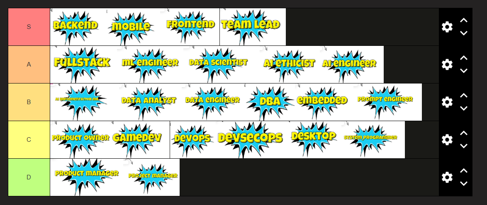

### Полезное видео

[Разница в профессиях, которые работают с данными](https://www.youtube.com/watch?v=VMdjCyhnJyA)

---

### Профессии, которые первично понравились:
1) DBA (администратор баз данных)
2. DevSecOps
3. AI Engineer
4. Data Analyst
5. Data Engineer
6. Data Scientist
7. ML Engineer
8. AI Ethicist / Responsible AI Specialist
9. AI Implementation Managers
10. Prompt Engineer
11. Backend-разработчик
12. DevOps-инженер
13. Frontend-разработчик
14. Fullstack-разработчик
15. GameDev
16. Мобильный разработчик
17. Разработчик встраиваемых систем (Embedded)
18. Разработчик десктопных приложений
19. Системный программист
20. Product Manager
21. Product Owner
22. Project Manager
23. Team Lead

### Мой тирлист:

### Лодка ценностей. То есть все профессии в порядке ТОПа:
1. Мобильный разработчик
2. Backend-разработчик
3. Frontend-разработчик
4. Team Lead
5. Fullstack-разработчик
6.  ML Engineer
7.  Data Scientist
8.  AI Ethicist / Responsible AI Specialist
9.  Разработчик встраиваемых систем (Embedded)
10. AI Engineer
11. Системный программист
12. Data Engineer
13. GameDev
14. DBA (администратор баз данных)
15. Data Analyst
16. AI Implementation Managers
17. Product Owner
18. DevOps-инженер
19. Product Manager
20. Project Manager
21. DevSecOps
22. Разработчик десктопных приложений
23. Prompt Engineer

### Профессии, которые хочу покопать до того, как исключать:
1. Мобильный разработчик:
2. Backend-разработчик
3. Frontend-разработчик
4. Team Lead
5. Fullstack-разработчик
6. ML Engineer
7. Data Scientist
8. Разработчик встраиваемых систем (Embedded)
9.  DBA/Data Engineer/Data Analyst
10.  DevOps-инженер
11.  Разработчик десктопных приложений

### Топ-7 на данный момент:
1. Мобильный разработчик
2. Backend-разработчик
3. Frontend-разработчик
4. Fullstack-разработчик (если до конца не определюсь бэк или фронт)
5.  ML Engineer? (оно мне надо?)
6.  Data Scientist? (оно мне надо?)
7*. (Team Lead)

### Топ-3:
1. Мобильный разработчик
2. Backend-разработчик
3. Frontend-разработчик (?)

Топ-5:
1. Мобильный разработчик 
2. Backend-разработчик 
3. Frontend-разработчик 
4. ML Engineer/Data Scientist 
5. DBA/Data Engineer/Data Analyst

---

# Проекты для реализации:

Профессии, которые хочу покопать до того, как исключать:
### 1. Мобильный разработчик:
(10 часов)

!!! Проект: To-Do List App с использованием Push-уведомлений

Разработать мобильное приложение для ведения списка дел, в котором можно добавлять, редактировать и удалять задачи.

Добавить возможность установки напоминаний с push-уведомлениями.

Реализовать синхронизацию с сервером для сохранения задач (например, с использованием Firebase).

Цель: Понять, как работает мобильная разработка, изучить особенности взаимодействия с нативными компонентами устройства.

### 2. Backend-разработчик:
Продолжать писать AllWays. Поработать с API
(4 часа)

### 3. Frontend-разработчик

!!! да Сверстать одну страницу AllWays
(4 часа)

### 4. Team Lead
Продолжать делать AllWays
(2 часа)
Распланируй развитие нашего проекта на 4-6 месяцев

### 5. Fullstack-разработчик
Продолжать делать AllWays

### 6. ML Engineer
### 7. Data Scientist
(8 часов)

!!! Проект: Прогнозирование спроса на товары в магазине

Цель: Проанализировать и визуализировать данные о продажах для понимания трендов.

Шаги:

Сбор данных: Загрузи данные о товарах и их продажах.

Предобработка данных: Очисти данные (обработка пропусков, типов, выбросов).

Анализ: Рассчитай основные статистики (средние, максимальные, минимальные продажи).

Визуализация: Построй графики (временные ряды, корреляции, гистограммы).

Инструменты: Python, Pandas, Matplotlib, Seaborn

Цель: Построить модель для прогнозирования количества продаж.

Шаги:

Подготовка данных: Выбери признаки и целевую переменную (например, цена и дата).

Моделирование: Обучи модель (начни с линейной регрессии, можно пробовать сложные модели).

Оценка: Проверь модель на тестовой выборке, используя метрики (MAE, RMSE).

Прогнозирование: Сделай прогноз на будущие продажи.

Инструменты: Python, Scikit-learn

### 8. Разработчик встраиваемых систем (Embedded)
(2 часа)

!!! Посмотреть как код на ардуино выглядит

### 9.  DBA/Data Engineer/Data Analyst
(2 часа)

!!! Проект: Система аналитики для онлайн-магазина

Разработать систему для сбора и анализа данных о покупках в онлайн-магазине (использование SQL для запросов).

Создать сводные таблицы и графики для анализа продаж, популярных товаров и поведения пользователей.

Цель: Изучить работу с базами данных, SQL-запросами, а также основы аналитики данных.

### 10.   DevOps-инженер
(2 часа)

!!! Использовать Docker покопать

### 11.   Разработчик десктопных приложений
(4 часа)

!!! заметка: FFmpeg проект дальше делать